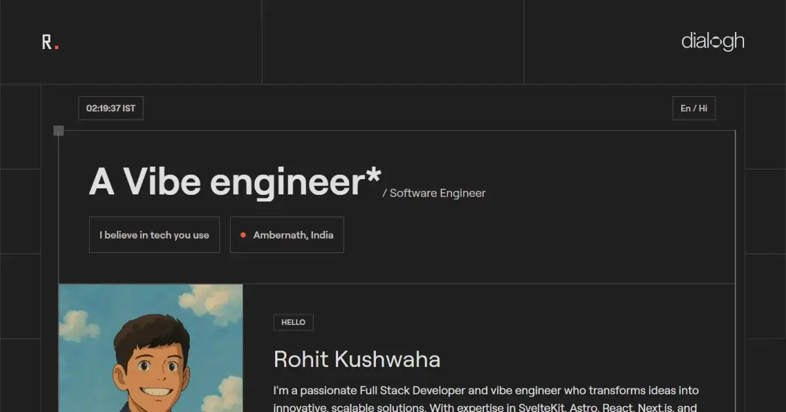

# 🚀 Rohit Kushwaha's Portfolio

<div align="center">
  
  <p><em>Modern, responsive full-stack developer portfolio</em></p>
</div>

[](https://astro.build)
[](https://rohitk06.in)
[](https://github.com/devrohit06/portfolio)
[](./LICENSE)

## ✨ Features

- 🎨 **Modern UI/UX** with seamless animations using GSAP
- 📱 **Fully Responsive** design for all devices
- 🌙 **Dark/Light Mode** with smooth transitions
- ⚡ **Blazing Fast** performance with Astro
- 🧩 **Component Islands** with React, Svelte & more
- 📝 **Blog System** with MDX support
- 🔍 **SEO Optimized** with meta tags, Open Graph and JSON-LD
- 📊 **GitHub Activity Integration** showing live contributions
- 💬 **Discord Status** integration
- 📈 **Analytics Ready** infrastructure

## 🛠️ Tech Stack

- **Framework**: [Astro](https://astro.build/)
- **UI Components**: [React](https://react.dev/), [Svelte](https://svelte.dev/)
- **Styling**: [TailwindCSS](https://tailwindcss.com/)
- **Animations**: [GSAP](https://greensock.com/gsap/)
- **Typography**: Custom Roobert font
- **Deployment**: [Vercel](https://vercel.com/)

## 🖥️ Local Development

```bash
# Clone the repository
git clone https://github.com/DevRohit06/portfolio.git

# Enter the project directory
cd portfolio

# Install dependencies
npm install
# or
bun install

# Start the development server
npm run dev
# or
bun dev
```

The site will be available at `http://localhost:4321`

## 🏗️ Build

```bash
# Build for production
npm run build
# or
bun run build

# Preview the production build
npm run preview
# or
bun run preview
```

## 📂 Project Structure

```
/
├── public/              # Static assets
│   ├── fonts/           # Custom web fonts
│   └── images/          # Images and icons
├── src/
│   ├── assets/          # Project assets requiring processing
│   ├── components/      # UI Components
│   │   ├── astro/       # Astro components
│   │   ├── react/       # React components
│   │   └── svelte/      # Svelte components
│   ├── content/         # Blog content
│   ├── layouts/         # Page layouts
│   ├── lib/             # Utility libraries
│   ├── pages/           # Page routes
│   └── styles/          # CSS styles
└── package.json         # Project dependencies and scripts
```

## 📝 License

This project is available as open source under the terms of the [MIT License](./LICENSE).

## 🔗 Connect with Me

[](https://linkedin.com/in/rohitk06)
[](https://github.com/devrohit06)

---

<div align="center">
  <p>💻 Designed & Developed with ❤️ by <a href="https://dialogh.in">Dialogh</a></p>
</div>
